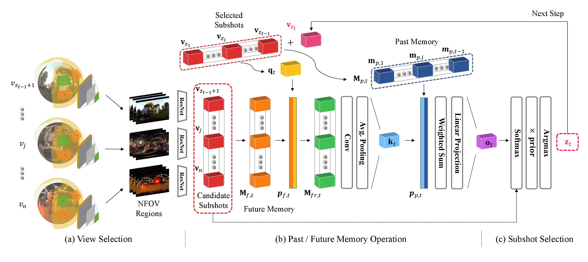

# PFMN



This project hosts the PyTorch implementation code for our **CVPR 2018** paper.

- Sangho Lee, Jinyoung Sung, Youngjae Yu and Gunhee Kim. A Memory Network Approach for Story-based Temporal Summarization of 360&deg; Videos. In *CVPR*, 2018. [[arxiv]](https://arxiv.org/abs/1805.02838)

We propose a novel memory network model named *Past-Future Memory Network* (PFMN) for story-based temporal summarization of 360&deg; videos.
PFMN first computes the score of 81 normal field of view (NFOV) region proposals cropped from the input 360&deg; video, and then recovers a latent, collective storyline using a memory network that involves two external memories to store the embeddings of previously selected subshots and future candidate subshots.
Our major contributions are two-fold.
First, our work is the first to address story-based temporal summarization of 360&deg; videos.
Second, our model is the first attempt to leverage memory networks for video summarization tasks.
We empirically validated that the proposed memory network approach outperformed other state-of-the-art methods, not only for view selection but also for story-based temporal summarization in both 360&deg; videos and photostreams.

## Acknowledgement

We appreciate Joonil Na, Jaemin Cho and [Juyong Kim](http://juyongkim.com/) for helpful comments and discussions.

## Authors

Sangho Lee, Jinyoung Sung, [Youngjae Yu](https://yj-yu.github.io/home/) and [Gunhee Kim](http://vision.snu.ac.kr/~gunhee/)

[Vision and Learning Lab](http://vision.snu.ac.kr/) @ Computer Science and Engineering, Seoul National University, Seoul, the Republic of Korea

## Reference

If you use this code or dataset as part of any published research, please refer to the following paper.
```
@inproceedings{lee2018pfmn,
    author    = {Sangho Lee and Jinyoung Sung and Youngjae Yu and Gunhee Kim},
    title     = {{A Memory Network Approach for Story-based Temporal Summarization of 360\deg~Videos}},
    booktitle = {CVPR},
    year      = 2018
}
```

## License

MIT license
